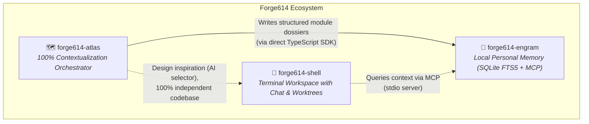
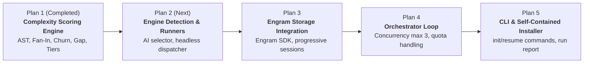

# 01 (EN). Scope, Ecosystem, and Orchestrator Design

> **Official Technical Reference Document — Forge614 Ecosystem**  
> **Project:** Forge614 Atlas (Deep Contextualization Orchestrator)  
> **Base Specification:** `docs/superpowers/specs/2026-09-18-atlas-orchestrator-design.md`  
> **Status:** Comprehensive design approved | Plan 1/5 implemented and verified  
> **Sister translation:** [01. Alcance, Ecosistema y Diseño del Orquestador](../es/01-alcance-y-diseno-del-orquestador.md)

---

## 1. Mission and Purpose of Forge614 Atlas

When a developer introduces an AI coding assistant (such as Claude Code or OpenAI Codex) into a large repository, they encounter the phenomenon of **context window amnesia and blindness** (working memory limits of LLMs):
1. The model cannot simultaneously ingest tens of thousands of lines of code without overflowing its context window.
2. Repeatedly re-reading files across sessions to comprehend dependencies consumes massive volumes of API tokens and developer subscriptions.
3. Once the terminal session terminates or a new conversation begins, all accumulated understanding evaporates, requiring a complete restart.

**Forge614 Atlas** solves this challenge by functioning as an **exhaustive codebase cartographer and orchestrator**:
- It inspects the target repository end-to-end, folder by folder, module by module.
- It deterministically evaluates module complexity without incurring any AI token costs.
- It dispatches AI worker processes (*subagents*) using the user's existing authenticated CLI tooling in headless (non-interactive) mode.
- It produces rich technical explanations covering system architecture, key design decisions, control flow, and inter-module dependencies.
- It persists this structured knowledge immediately and incrementally into **`forge614-engram`** (the local personal memory engine powered by SQLite FTS5).

Once Atlas completes its run, the target codebase is "100% contextualized". Any future conversational assistant simply queries Engram via the standard Model Context Protocol (MCP) and instantly recovers the complete repository map without re-reading source files.

---

## 2. Positioning within the Forge614 Ecosystem

The Forge614 ecosystem consists of three specialized, complementary, yet independent projects:

### Relationship with `forge614-engram`
- **Engram is the central memory authority:** It stores persistent memories, progressive sessions, timeline reconstructions, and project identities.
- **Atlas is its primary structured knowledge producer:** Atlas writes detailed dossiers module-by-module directly through Engram's **public TypeScript SDK** (`MemoryStore`), ensuring execution speed and compile-time type safety.
- **Strict single-writer ownership:** Only the primary Atlas orchestrator writes to Engram. Subagents simply output raw analysis to standard output; Atlas validates, tags, and archives the entries.

### Relationship with `forge614-shell`
- **Absolute independence:** Atlas **does not import nor depend** on `forge614-shell`.
- **Shared philosophy, isolated implementation:** Both projects share the UX pattern of detecting locally installed AI CLI binaries (`claude`, `codex`) and prompting the user with an interactive arrow menu. However, Atlas maintains its own clean implementation without linking to Shell's packages.

---

## 3. Implementation Roadmap (The 5 Plans)

Forge614 Atlas is implemented across five discrete, modular phases:

1. **Plan 1 (This Component): Deterministic Complexity Scoring Engine.**
   Discovers modules, extracts AST metrics with TypeScript, computes fan-in centrality, tracks Git churn, evaluates unit test gaps, calculates composite scores, and classifies into percentile tiers (Deep, Standard, Light).
2. **Plan 2: Engine Detection and Subagent Dispatcher.**
   Detects AI binaries in `$PATH`, renders an interactive TUI selector, and manages headless command execution against authenticated user CLIs.
3. **Plan 3: Root Analysis Adaptation and Engram SDK Integration.**
   Adapts module discovery to handle nested project layouts (`src/{auth,billing}`) and integrates the Engram SDK to write progressive session entries.
4. **Plan 4: Orchestrator Loop, Concurrency Control, and Quota Handling.**
   Manages task scheduling, enforces a strict 3-worker concurrency cap, and handles quota exhaustion gracefully (`resume` workflow).
5. **Plan 5: CLI Surface, Final Run Report, and Standalone Installer.**
   Exposes `forge614-atlas init` and `resume` CLI commands, displays aggregated runtime metrics (tokens, time, models used), and provides `install.sh`.

---

## 4. Hard Operational Rules and System Policies

The Atlas architecture is governed by four non-negotiable operational rules:

### Rule 1: Reasoning Effort NEVER Exceeds `medium`
> [!IMPORTANT]
> **Cost-to-Value Policy:** No AI subagent launched by Atlas may ever be configured with reasoning effort set to `high`, `xhigh`, `extra high`, `max`, or `ultra`. The computational cost of contextualizing a module must never exceed the value of the code being developed.

### Rule 2: Strict Model Matrix by Complexity Tier
Model selection is tied directly to the module's assigned complexity tier:

| Module Tier | Claude Code | OpenAI Codex | Assigned Reasoning Effort |
|---|---|---|:---:|
| **Light (~bottom 50%)** | Haiku 4.5 | `gpt-5.6-luna` | `low` |
| **Standard (~middle 35%)** | Sonnet 5 | `gpt-5.6-terra` | `medium` |
| **Deep (~top 15%)** | Opus 5 | `gpt-5.6-sol` | `medium` |

### Rule 3: Strict 3-Worker Concurrency Limit
Atlas enforces an immutable concurrency ceiling of **3 simultaneous subagents**. While this does not alter total token consumption, it prevents triggering harsh API rate limits or rapidly burning through hourly subscription quotas on large repositories.

### Rule 4: Fresh Engine Selection on Every Run
Atlas **never persists AI engine choices to configuration files**. Each invocation of `forge614-atlas init` or `resume` inspects `$PATH` and presents the interactive selection menu anew, allowing the user to select the appropriate engine for that specific session.
