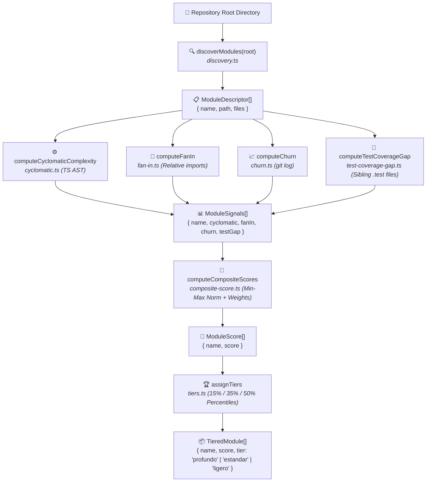

# 02 (EN). Scoring Engine Architecture (Plan 1/5)

> **Official Technical Reference Document — Forge614 Ecosystem**  
> **Project:** Forge614 Atlas (Deep Contextualization Orchestrator)  
> **Component:** `src/modules/scoring/` and `src/index.ts`  
> **Design Pattern:** Feature-Oriented Modular Monolith with Colocated Tests  
> **Guarantee:** Pure determinism (0 network requests, 0 AI model calls, <span color="green">100% reproducible</span>)  
> **Sister translation:** [02. Arquitectura del Motor de Puntuación](../es/02-arquitectura-motor-puntuacion.md)

---

## 1. Scoring Pipeline Architecture Overview

The Forge614 Atlas scoring engine is constructed around an immutable engineering premise: **code complexity evaluation must be mathematical, reproducible, instantaneous, and zero-cost**.

Relying on an AI model to gauge codebase complexity would introduce critical drawbacks:
- It would consume hundreds of thousands of tokens before actual documentation work even starts.
- It would produce non-deterministic, stochastic outputs: a folder could be assigned "Deep" on one run and "Light" on the next without code modifications.
- It would require network connectivity and active third-party API credentials just to inspect local directory trees.

To eliminate these vulnerabilities, Atlas employs a **purely analytical and deterministic pipeline** in TypeScript:



---

## 2. Pipeline Subsystems

Each pipeline stage is encapsulated in a dedicated module within `src/modules/scoring/`, accompanied by its colocated test suite:

### 2.1 Module Discovery (`discovery.ts`)
- **Responsibility:** Scans the target repository root to identify top-level directories qualifying as distinct software modules.
- **Inclusion Criteria:** A directory is classified as a module if it contains at least one source file ending in `.ts`, `.tsx`, `.js`, or `.jsx`.
- **Strict Exclusions:** Immediately filters out build output artifacts, dependency trees, and VCS internal directories:
  `node_modules`, `.git`, `dist`, `build`, `coverage`, `.next`, `out`, `.forge614`, and any directory beginning with a dot (`.`).
- **`isTestFile` Helper:** Detects test files via `/\.(test|spec)\.[tj]sx?$/` so downstream complexity and fan-in stages can filter them out.

### 2.2 Cyclomatic Complexity (`cyclomatic.ts`)
- **Responsibility:** Measures the number of linearly independent paths through the module source code.
- **Mechanism:** Leverages the TypeScript compiler parser API (`ts.createSourceFile`) to construct an in-memory Abstract Syntax Tree (*AST*) without emitting build artifacts or performing full type-checking passes.
- **Test Exclusion:** Automatically ignores `*.test.*` and `*.spec.*` files so unit test assertions and mock suites do not artificially inflate module complexity.

### 2.3 Fan-In Centrality (`fan-in.ts`)
- **Responsibility:** Measures how many **distinct external modules** in the codebase import code from the target module.
- **Mechanism:** Parses `import ... from`, `export ... from`, and dynamic `require(...)` expressions, resolving relative paths (`./`, `../`) against extensions `.ts`, `.tsx`, `.js`, `.jsx`, or directory `index.*` entrypoints.
- **Key Safety Invariants:** Excludes internal self-imports within the same module, ignores test files, and counts **unique importing modules**, preventing multiple file imports from the same consumer from skewing centrality.

### 2.4 Historical Commit Churn (`churn.ts`)
- **Responsibility:** Quantifies the frequency of historical modifications across the module's file history.
- **Mechanism:** Invokes `git log --name-only` to parse all file paths modified across the repository's commit log.
- **Strict UTF-8 Handling:** Runs Git with `-c core.quotepath=false` to prevent paths containing accented letters, ñ, or non-ASCII characters from being octal-escaped, resolving an issue where Spanish-named modules registered zero churn.

### 2.5 Test Coverage Gap (`test-coverage-gap.ts`)
- **Responsibility:** Quantifies module test deficit by computing the ratio of production source files lacking a sibling test file (`.test.*` or `.spec.*`).
- **Range:** Yields a normalized value between `0.0` (all source files possess a sibling test) and `1.0` (zero source files are tested).

### 2.6 Weighted Composite Scoring (`composite-score.ts`)
- **Responsibility:** Blends the heterogeneous signals into a unified, balanced metric.
- **Min-Max Normalization:** Maps diverse scales (e.g., cyclomatic complexity from 1 to 500, fan-in from 0 to 12) onto the closed interval `[0.0, 1.0]`.
- **Weighted Formula:** Allocates 35% to cyclomatic complexity, 35% to fan-in, and 30% to churn, applying the test coverage gap as a **multiplicative modifier** that amplifies score only when inherent complexity is already present.

### 2.7 Percentile-Based Tier Assignment (`tiers.ts`)
- **Responsibility:** Groups modules sorted by composite score into operational categories: `profundo`, `estandar`, and `ligero`.
- **Deterministic Tie-Breaking:** Employs alphabetical sorting (`localeCompare`) on module names when composite scores tie, ensuring identical runs always produce identical tier assignments.

---

## 3. Public Library Surface (`src/index.ts`)

The library exports its entire public interface through a single barrel file at `src/index.ts`, configured in `package.json` under `"exports": "./src/index.ts"`:

```typescript
// Discovery
export { discoverModules, isTestFile } from "./modules/scoring/discovery";
export type { ModuleDescriptor } from "./modules/scoring/discovery";

// AST Complexity
export { fileCyclomaticComplexity, computeCyclomaticComplexity } from "./modules/scoring/cyclomatic";

// Dependency Centrality
export { computeFanIn } from "./modules/scoring/fan-in";

// Git Churn
export { computeChurn } from "./modules/scoring/churn";

// Test Coverage Gap
export { computeTestCoverageGap } from "./modules/scoring/test-coverage-gap";

// Composite Scoring
export { computeCompositeScores } from "./modules/scoring/composite-score";
export type { ModuleSignals, ModuleScore } from "./modules/scoring/composite-score";

// Tier Classification
export { assignTiers } from "./modules/scoring/tiers";
export type { Tier, TieredModule } from "./modules/scoring/tiers";
```

Downstream Atlas subsystems (such as the Plan 3 session writer or the Plan 4 orchestration loop) import these functions directly:

```typescript
import {
  discoverModules,
  computeCyclomaticComplexity,
  computeFanIn,
  computeChurn,
  computeTestCoverageGap,
  computeCompositeScores,
  assignTiers,
} from "forge614-atlas";
```
