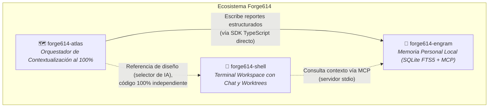
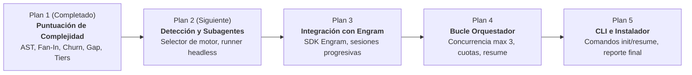

# 01. Alcance, Ecosistema y Diseño del Orquestador

> **Documento Oficial de Referencia Técnica — Ecosistema Forge614**  
> **Proyecto:** Forge614 Atlas (Orquestador de Contextualización Profunda)  
> **Especificación Base:** `docs/superpowers/specs/2026-09-18-atlas-orchestrator-design.md`  
> **Estado:** Diseño integral aprobado | Plan 1/5 implementado y verificado  
> **Traducción hermana:** [01 (EN). Scope, Ecosystem, and Orchestrator Design](../en/01-scope-and-orchestrator-design.md)

---

## 1. Misión y Propósito de Forge614 Atlas

Cuando un desarrollador abre un asistente de inteligencia artificial (como Claude Code o Codex) en un proyecto grande, se enfrenta al fenómeno de la **amnesia y ceguera de contexto** (*context window limits* o límite de memoria del modelo):
1. El modelo no puede leer simultáneamente miles de líneas de código sin saturar su memoria de trabajo (*context window*).
2. Leer repetidamente archivos para entender la arquitectura consume una cantidad exorbitante de tokens y dinero en cada sesión.
3. Al cerrar la terminal o iniciar una nueva conversación, todo el entendimiento acumulado se evapora y debe reiniciarse desde cero.

**Forge614 Atlas** resuelve este problema actuando como un **cartógrafo y orquestador exhaustivo**:
- Recorre el repositorio de punta a punta, carpeta por carpeta, módulo por módulo.
- Analiza deterministamente la complejidad de cada módulo sin costo de IA.
- Despacha mandaderos (*subagents* o subprocesos autónomos) alimentados por la propia suscripción de IA del desarrollador en modo no interactivo (*headless*).
- Redacta explicaciones profundas de arquitectura, patrones, flujo de datos y dependencias críticas.
- Deposita ese conocimiento de forma inmediata e incremental en **`forge614-engram`** (memoria personal local en SQLite FTS5).

Al finalizar la corrida de Atlas, el repositorio queda "contextualizado al 100%". Cualquier asistente conversacional futuro simplemente consulta a Engram mediante MCP (*Model Context Protocol*) y recupera al instante el mapa completo del proyecto sin releer el código fuente.

---

## 2. Posición en el Ecosistema Forge614

El ecosistema Forge614 se compone de tres proyectos especializados, complementarios e independientes:

### Relación con `forge614-engram`
- **Engram es el repositorio central de memoria:** Almacena recuerdos, sesiones progresivas y asociaciones de proyectos.
- **Atlas es su principal productor estructurado:** Atlas escribe reportes exhaustivos módulo por módulo directamente a través del **SDK público de TypeScript** de Engram (`MemoryStore`), garantizando velocidad y seguridad de tipos en tiempo de compilación.
- **Propiedad estricta de la escritura:** Solo el orquestador principal de Atlas escribe en Engram. Los subagentes únicamente devuelven texto crudo a la salida estándar; Atlas valida, etiqueta y archiva.

### Relación con `forge614-shell`
- **Independencia absoluta:** Atlas **no importa ni depende** de `forge614-shell`.
- **Patrón compartido pero aislado:** Ambos proyectos comparten la filosofía de detectar herramientas de IA instaladas en la máquina (`claude`, `codex`) y mostrar un menú interactivo con flechas para seleccionar el motor deseado. Sin embargo, Atlas implementa su propio código limpio sin importar librerías internas de Shell.

---

## 3. Hoja de Ruta de Implementación (Los 5 Planes)

La construcción de Forge614 Atlas se planificó en cinco etapas independientes y modulares:

1. **Plan 1 (Este componente): Motor determinista de puntuación de complejidad.**
   Descubre módulos, extrae AST con TypeScript, calcula *fan-in*, mide *churn* en Git, evalúa la cobertura de pruebas, calcula puntaje compuesto ponderado y distribuye en percentiles (Profundo, Estándar, Ligero).
2. **Plan 2: Detección de motores y despacho de subagentes.**
   Detecta ejecutables en `$PATH`, presenta menú interactivo TUI y ejecuta llamadas *headless* (sin interfaz) a las CLIs autenticadas del usuario.
3. **Plan 3: Integración de raíz de análisis y almacenamiento en Engram.**
   Adapta el descubrimiento de módulos a estructuras anidadas (`src/{auth,billing}`) e integra el SDK de Engram para registrar entradas progresivas con metadatos de sesión.
4. **Plan 4: Bucle orquestador, concurrencia y control de cuota.**
   Maneja la cola de trabajo, limita la concurrencia a exactamente 3 subagentes paralelos y detecta pausas de cuota para permitir reanudación (`resume`).
5. **Plan 5: Superficie CLI, reporte final e instalador autónomo.**
   Expone los comandos `forge614-atlas init` y `resume`, calcula estadísticas de corrida (tokens, tiempo, modelos usados) y provee el script de instalación `install.sh`.

---

## 4. Reglas Duras de Operación y Políticas del Sistema

El diseño de Atlas incorpora cuatro reglas inflexibles que rigen su funcionamiento:

### Regla 1: El nivel de razonamiento NUNCA supera `medio`
> [!IMPORTANT]
> **Regla de costo/beneficio:** Ningún mandadero de IA despachado por Atlas puede solicitar esfuerzo de razonamiento (*reasoning effort*) configurado en `alto`, `xhigh`, `extra high`, `max` ni `ultra`. El costo en tiempo y tokens de contextualizar un módulo jamás debe sobrepasar el valor del código analizado.

### Regla 2: Matriz estricta de asignación por nivel
La asignación de modelos y razonamiento sigue una matriz estricta según el nivel asignado por el motor de puntuación:

| Nivel del Módulo | Claude Code | OpenAI Codex | Razonamiento Asignado |
|---|---|---|:---:|
| **Ligero (~50% inferior)** | Haiku 4.5 | `gpt-5.6-luna` | `bajo` (*low*) |
| **Estándar (~35% medio)** | Sonnet 5 | `gpt-5.6-terra` | `medio` (*medium*) |
| **Profundo (~15% superior)** | Opus 5 | `gpt-5.6-sol` | `medio` (*medium*) |

### Regla 3: Concurrencia estricta de 3 mandaderos
Atlas mantiene un máximo inmutable de **3 subagentes concurrentes** en ejecución simultánea. Esta cota no altera el volumen total de tokens consumidos, pero previene saturar abruptamente los límites de tasa (*rate limits*) y ventanas de cuota por hora de las suscripciones de los usuarios.

### Regla 4: Elección de motor fresca en cada corrida
Atlas **no persiste en archivos de configuración** qué motor de IA se eligió. En cada invocación de `forge614-atlas init` o `resume`, consulta el `$PATH` y despliega el menú interactivo para que el usuario elija conscientemente con qué herramienta trabajar.
