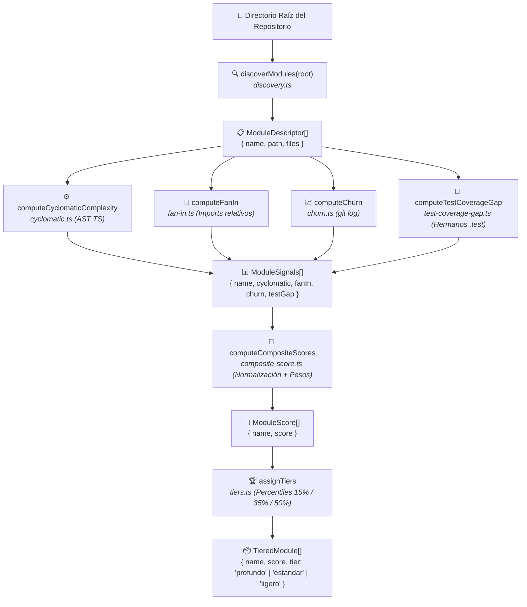

# 02. Arquitectura del Motor de Puntuación (Plan 1/5)

> **Documento Oficial de Referencia Técnica — Ecosistema Forge614**  
> **Proyecto:** Forge614 Atlas (Orquestador de Contextualización Profunda)  
> **Componente:** `src/modules/scoring/` y `src/index.ts`  
> **Patrón:** Monolito Modular por Funcionalidad (*Feature-Oriented Modular Monolith*) con Pruebas Colocalizadas  
> **Garantía:** Determinismo puro (0 llamadas a red, 0 llamadas a modelos de IA, <span color="green">100% reproducible</span>)  
> **Traducción hermana:** [02 (EN). Scoring Engine Architecture](../en/02-scoring-engine-architecture.md)

---

## 1. Visión General del Pipeline de Puntuación

El motor de puntuación de Forge614 Atlas está diseñado bajo un principio estricto: **la evaluación de la complejidad del código debe ser matemática, predecible, instantánea y de costo cero**.

Si usáramos un modelo de inteligencia artificial para decidir qué partes del código son complejas:
- Consumiríamos cientos de miles de tokens antes de empezar a documentar.
- Obtendríamos resultados estocásticos (no deterministas): una carpeta podría clasificarse como "Profunda" en una corrida y como "Ligera" en la siguiente sin haber cambiado el código.
- Se requeriría acceso a internet y llaves de API activas solo para inspeccionar archivos locales.

Por ello, Atlas implementa un **pipeline puramente analítico y determinista** en TypeScript:



---

## 2. Los Componentes del Pipeline

Cada etapa del pipeline reside en un archivo especializado dentro de `src/modules/scoring/`, acompañado de su suite de pruebas hermana:

### 2.1 Descubrimiento de Módulos (`discovery.ts`)
- **Responsabilidad:** Escanear el directorio raíz del repositorio e identificar carpetas de primer nivel que califiquen como módulos de software.
- **Criterio de Inclusión:** Una carpeta se considera módulo si contiene al menos un archivo con extensión `.ts`, `.tsx`, `.js` o `.jsx`.
- **Exclusiones Rigurosas:** Omite de inmediato carpetas de artefactos de compilación y control de versiones:
  `node_modules`, `.git`, `dist`, `build`, `coverage`, `.next`, `out`, `.forge614` y cualquier directorio que comience con punto (`.`).
- **Función Auxiliar `isTestFile`:** Detecta archivos de prueba mediante la expresión regular `/\.(test|spec)\.[tj]sx?$/` para excluirlos de métricas de complejidad ciclomática y *fan-in*.

### 2.2 Complejidad Ciclomática (`cyclomatic.ts`)
- **Responsabilidad:** Calcular la cantidad de rutas independientes de ejecución en el código fuente de cada módulo.
- **Mecanismo:** Utiliza la API del compilador de TypeScript (`ts.createSourceFile`) para generar un Árbol de Sintaxis Abstracta (*AST* o estructura jerárquica de nodos gramaticales) y recorrerlo en memoria sin compilar a disco.
- **Exclusión de Pruebas:** Excluye archivos `*.test.*` y `*.spec.*` para evitar inflar artificialmente la complejidad de un módulo debido a sus baterías de pruebas.

### 2.3 Centralidad Fan-In (`fan-in.ts`)
- **Responsabilidad:** Medir cuántos **otros módulos distintos** del proyecto importan código del módulo evaluado.
- **Mecanismo:** Analiza sentencias `import ... from`, `export ... from` y llamadas `require(...)`, resolviendo rutas relativas (`./`, `../`) contra extensiones `.ts`, `.tsx`, `.js`, `.jsx` o archivos `index.*`.
- **Filtrado Clave:** No cuenta las auto-importaciones internas del mismo módulo, ni los archivos de pruebas, y contabiliza **módulos cliente únicos**, evitando que múltiples importaciones desde un mismo archivo distorsionen la métrica.

### 2.4 Volatilidad Histórica Churn (`churn.ts`)
- **Responsabilidad:** Cuantificar la actividad y frecuencia de cambios históricos en los archivos del módulo.
- **Mecanismo:** Ejecuta `git log --name-only` para extraer la lista de archivos modificados a lo largo de la historia de commits del repositorio.
- **Soporte UTF-8 Estricto:** Invoca Git con `-c core.quotepath=false` para evitar que rutas con acentos, eñes o caracteres no ASCII se escapen en notación octal, lo que en versiones preliminares causaba que módulos con nombres en español registraran *churn* igual a cero.

### 2.5 Brecha de Cobertura de Pruebas (`test-coverage-gap.ts`)
- **Responsabilidad:** Evaluar la vulnerabilidad del módulo calculando la proporción de archivos fuente que carecen de un archivo de prueba hermano (`.test.*` o `.spec.*`).
- **Rango:** Produce un valor entre `0.0` (todos los archivos tienen prueba hermana) y `1.0` (ningún archivo tiene prueba).

### 2.6 Puntuación Compuesta Ponderada (`composite-score.ts`)
- **Responsabilidad:** Unificar las cuatro señales dispares en una sola métrica normalizada y balanceada.
- **Normalización Min-Max:** Transforma las escalas heterogéneas (por ejemplo, ciclomática de 1 a 400 y fan-in de 0 a 8) al intervalo cerrado `[0.0, 1.0]`.
- **Estructura Ponderada:** Aplica pesos del 35% a ciclomática, 35% a *fan-in* y 30% a *churn*, aplicando la brecha de pruebas como un **modificador multiplicativo** que solo eleva el puntaje cuando el código ya es intrínsecamente complejo.

### 2.7 Asignación de Niveles por Percentil (`tiers.ts`)
- **Responsabilidad:** Agrupar los módulos ordenados por puntaje en las categorías operativas `profundo`, `estandar` y `ligero`.
- **Determinismo en Empates:** Utiliza el nombre del módulo en orden alfabético (`localeCompare`) como criterio de desempate, garantizando que dos ejecuciones con puntajes idénticos siempre asignen exactamente los mismos niveles.

---

## 3. La Superficie Pública de la Librería (`src/index.ts`)

La librería concentra toda su superficie pública en un archivo barril (*barrel export*) en `src/index.ts`, registrado formalmente en `package.json` mediante la propiedad `"exports": "./src/index.ts"`:

```typescript
// Descubrimiento
export { discoverModules, isTestFile } from "./modules/scoring/discovery";
export type { ModuleDescriptor } from "./modules/scoring/discovery";

// Métricas de AST
export { fileCyclomaticComplexity, computeCyclomaticComplexity } from "./modules/scoring/cyclomatic";

// Centralidad de dependencias
export { computeFanIn } from "./modules/scoring/fan-in";

// Volatilidad en Git
export { computeChurn } from "./modules/scoring/churn";

// Brecha de pruebas
export { computeTestCoverageGap } from "./modules/scoring/test-coverage-gap";

// Puntuación compuesta
export { computeCompositeScores } from "./modules/scoring/composite-score";
export type { ModuleSignals, ModuleScore } from "./modules/scoring/composite-score";

// Clasificación en niveles
export { assignTiers } from "./modules/scoring/tiers";
export type { Tier, TieredModule } from "./modules/scoring/tiers";
```

Cualquier otro componente de Atlas (como el orquestador del Plan 3 o el bucle del Plan 4) puede importar estas funciones limpiamente:

```typescript
import {
  discoverModules,
  computeCyclomaticComplexity,
  computeFanIn,
  computeChurn,
  computeTestCoverageGap,
  computeCompositeScores,
  assignTiers,
} from "forge614-atlas";
```
